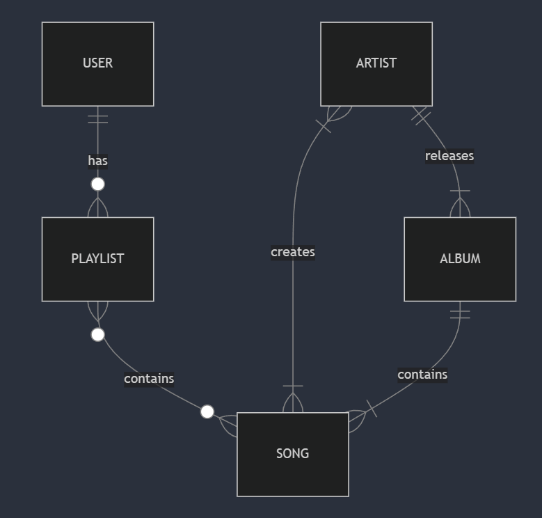

# Design Document - Spotify's Database

## Scope

The purpose of the database is to manage and store detailed information about users, their music preferences, and their playlists. It will include data on users, artists, albums, and user-created playlists, capturing the relationships between these elements. However, the database will not encompass podcasts, liked playlists, advertisements, or any connections between users. This focused approach ensures that the database efficiently handles user-specific music interactions and preferences without integrating unrelated features.

## Functional Requirements

Users should be able to view all available songs, create playlists with these songs, explore other users and their playlists, view artist information, see the most popular songs, and check out recent albums. However, the database will not allow users to access podcasts, or see details about followers and following relationships. This scope ensures that the focus remains on core music discovery and interaction features.

## Representation

### Entities

  
 Users Table 

  - `id`: The unique identifier for each user.
  - `username`: The username chosen by the user, which must be unique.
  - `creation_date`: The date when the user created their account.

  
 Artists Table

  
  - `id`: The unique identifier for each artist.
  - `name`: The name of the artist.
  - `creation_date`: The date when the artist entity was created.

  
 Albums Table 

  - `id`: The unique identifier for each album.
  - `name`: The name of the album, which must be unique.
  - `released_date`: The release date of the album.
  - `artist_id`: The ID of the artist associated with the album (only one artist per album).

  
 Songs Table 

  - `id`: The unique identifier for each song.
  - `name`: The name of the song, which must be unique.
  - `duration`: The length of the song, in seconds
  - `album_id`: The album the song belongs to

  
 Playlists Table 

  
  - `id`: The unique identifier for each playlist.
  - `user_id`: The ID of the user who owns the playlist.
  - `name`: The name of the playlist.

  
 Artists-Songs Table 

  - `song_id`: The ID of the song.
  - `artist_id`: The ID of the artist.

  
 Playlists-Songs Table 

  - `playlist_id`: The ID of the playlist.
  - `song_id`: The ID of the song.

### Constraints

- One user can not have two or more playlists with the same name.
- A playlists can not have duplicated songs.
- The songs must have unique names, i.e. there can not exists two or more songs with the same name.
- Multiple artists can belong to multiple songs, so a `artists-songs`table was created.

### Relationships

## Optimizations

- Create an index for `name` in `album` table. 
- Create an index for `artist_id` in the table `artist_songs`, so the user can find quickly the songs of the desire artist.
- Create an index for `user_id` in `playlists` table, so the user can find his playlists.
- Create an index for `playlist_id` in `playlists_songs` table.
- Create a view for the most popular songs of all times.

## Limitations

Might struggle with scalability as the number of users, songs, playlists, and interactions grows. Handling millions of concurrent users, billions of songs, and real-time data processing can lead to performance bottlenecks.

May suffer from data redundancy or lack of optimization strategies. It might use basic normalization techniques, which could lead to inefficient storage and retrieval as the data grows.

#### What might your database not be able to represent very well?

The schema focuses on core entities (users, artists, songs, playlists, albums) and their direct relationships. It might not efficiently handle more complex queries, such as recommendations, user behavior analysis, or content-based filtering.

Limited support for complex user interactions, such as sharing playlists, following other users or artists, and real-time updates on what friends are listening to.
