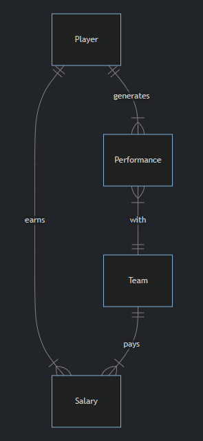

# Schema

Moneyball.db represents all of **Major League Baseball’s players, teams, salaries, and performances** up until 2001. In particular, moneyball.db represents the following entities:

- A **player**, which includes anyone who’s played Major League Baseball for any amount of time
- A **team**, which includes all teams, past and present, in Major League Baseball
- A **performance**, which describes the types of hits a player made for their team in a given year
- A **salary**, which is the amount of money a team paid one of their players in a given year

### Players table

The **players table** contains the following columns:

- `id`, which is the ID of the player
- `first_name`, which is the first name of the player
- `last_name`, which is the last name of the player
- `bats`, which is the side (“R” for right or “L” for left) the player bats on
- `throws`, which is the hand (“R” for right or “L” for left) the player throws with
- `weight`, which is the player’s weight in pounds
- `height`, which is the player’s height in inches
- `debut`, which is the date (expressed as YYYY-MM-DD) the player began their career in the MLB
- `final_game`, which is the date (expressed as YYYY-MM-DD) the player played their last game in the MLB
- `birth_year`, which is the year the player was born
- `birth_month`, which is the month (expressed as an integer) the player was born
- `birth_day`, which is the day the player was born
- `birth_city`, which is the city in which the player was born
- `birth_state`, which is the state in which the player was born
- `birth_country`, which is the country in which the player was born

### Teams table

The **teams table** contains the following columns:

- `id`, which is the ID of each team
- `year`, which is the year the team was founded
- `name`, which is the name of the team
- `park`, which is name of the park at which the team plays (or played)

### Performances table

The **performances table** contains the following columns:

- `id`, which is the ID of the performance
- `player_id`, which is the ID of the player who generated the performance
- `team_id`, which is the ID of the team for which the player generated the performance
- `year`, which is the year in which the player generated the performance
- `G`, which is the number of games played by the player, for the given team, in the given year
- `AB`, which is the player’s number of “at bats” (i.e., times they went up to bat), for the given team, in the given year
- `H`, which is the player’s number of hits, for the given team, in the given year
- `2B`, which is the player’s number of doubles (two-base hits), for the given team, in the given year
- `3B`, which is the player’s number of triples (three-base hits), for the given team, in the given year
- `HR`, which is the player’s number of home runs, for the given team, in the given year
- `RBI`, which is the player’s number of “runs batted in” (i.e., runs scored), for the given team, in the given year
- `SB`, which is the player’s number of stolen bases, for the given team, in the given year

### Salaries table

The **salaries table** contains the following columns:

- `id`, which is the ID of the salary
- `player_id`, which is the ID of the player earning the salary
- `team_id`, which is the ID of the team paying the salary
- `year`, which is the year during which the salary was paid
- `salary`, which is the salary itself in US dollars (not adjusted for inflation)