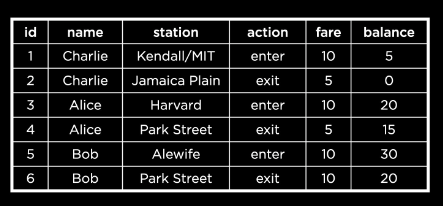

# Designing

## Craete a DataBase Schema

We are tasked with representing the subway system of the city of Boston through a database schema. This includes the subway stations, the different train lines, and the people who take the trains. To break down the question further, we need to decide…

- what kinds of tables we will have in our Boston Subway database,
- what columns each of the tables will have, and
- what types of data we should put in each of those columns.

### Normalizing

Observe this initial attempt at creating a table to **represent Boston Subway data**. This table contains subway **rider names, current stations** the riders are at and the action performed at the station (like entering and exiting). It also records the **fares paid and balance** amounts on their subway cards. This table also contains an ID for each rider “transaction”, which serves as the primary key.



We may choose to **separate out rider names into a table of its own, to avoid having to duplicate the names** so many times. We would need to give each rider an ID that can be used to relate the new table to this one.

We may similarly choose to **move subway stations to a different table** and give each subway station an ID to be used as a foreign key here.

The **process of separating our data** in this manner is called **normalizing**. When normalizing, we put each entity in its own table—as we did with riders and subway stations. Any information about a specific entity, for example a rider’s address, goes into the entity’s own table.

#### Relating

We now need to decide **how our entities** (riders and stations) **are related**. A rider will likely visit multiple stations, and a subway station is likely to have more than one rider. Given this, it will be a **many-to-many relationship**.

## Data Types and Storage Classes

SQLite has five storage classes:

- **Null:** nothing, or empty value
- **Integer:** numbers without decimal points
- **Real:** decimal or floating point numbers
- **Text:** characters or strings
- **Blob:** Binary Large Object, for storing objects in binary (useful for images, audio etc.)

**A storage class can hold several data types.** 

SQLite takes care of storing the input value under the right data type. However, columns in SQLite don’t always store one particular data type. They are said to have **type affinities**, meaning that they try to **convert an input value into the type they have an affinity for**.

## Create Table

We can create our own tables with the affinity types with the `CREATE TABLE` clause.

```SQL
CREATE TABLE riders (
    "id" INTEGER,
    "name" TEXT
);

CREATE TABLE stations (
    "id" INTEGER,
    "name" TEXT,
    "line" TEXT
);

CREATE TABLE visits (
    "rider_id" INTEGER,
    "station_id" INTEGER
);
```


## Constraints

### Table Constraints

We can use table constraints to **impose restrictions on certain values in our tables.** 

For example, a primary key column must have **unique values**. The table constraint we use for this is **PRIMARY KEY.** Similarly, a constraint on a foreign key value is that it must be found in the primary key column of the related table! This table constraint is called, predictably, FOREIGN KEY.

### Column Constraints

A column constraint is a type of constraint that applies to a specified column in the table. SQLite has four column constraints:

- **CHECK:** allows checking for a condition, like all values in the column must be greater than 0
- **DEFAULT:** uses a default value if none is supplied for a row
- **NOT NULL:** dictates that a null or empty value cannot be inserted into the column
- **UNIQUE:** dictates that every value in this column must be unique

An update schema with these constraints will be:

```sql
CREATE TABLE riders (
    "id" INTEGER,
    "name" TEXT,
    PRIMARY KEY("id")
);

CREATE TABLE stations (
    "id" INTEGER,
    "name" TEXT NOT NULL UNIQUE,
    "line" TEXT NOT NULL,
    PRIMARY KEY("id")
);

CREATE TABLE visits (
    "rider_id" INTEGER,
    "station_id" INTEGER,
    FOREIGN KEY("rider_id") REFERENCES "riders"("id"),
    FOREIGN KEY("station_id") REFERENCES "stations"("id")
);
```

## Altering Tables

**Drop a Table**
```sql
DROP TABLE "riders";
```

**Rename a Table**
```sql
ALTER TABLE "visits"
RENAME TO "swipes";
```

**Add a column**
```sql
ALTER TABLE "swipes"
ADD COLUMN "swipetype" TEXT;
```

**Rename a column**
```sql
ALTER TABLE "swipes"
RENAME COLUMN "swipetype" TO "type";
```

**Drop a Column**
```sql
ALTER TABLE "swipes"
DROP COLUMN "type";
```

## Final Schema

Finally aplying all these concepts we can imporve our database with the following schema:

```sql
CREATE TABLE "cards" (
    "id" INTEGER,
    PRIMARY KEY("id")
);

CREATE TABLE "stations" (
    "id" INTEGER,
    "name" TEXT NOT NULL UNIQUE,
    "line" TEXT NOT NULL,
    PRIMARY KEY("id")
);

CREATE TABLE "swipes" (
    "id" INTEGER,
    "card_id" INTEGER,
    "station_id" INTEGER,
    "type" TEXT NOT NULL CHECK("type" IN ('enter', 'exit', 'deposit')),
    "datetime" NUMERIC NOT NULL DEFAULT CURRENT_TIMESTAMP,
    "amount" NUMERIC NOT NULL CHECK("amount" != 0),
    PRIMARY KEY("id"),
    FOREIGN KEY("station_id") REFERENCES "stations"("id"),
    FOREIGN KEY("card_id") REFERENCES "cards"("id")
);
```