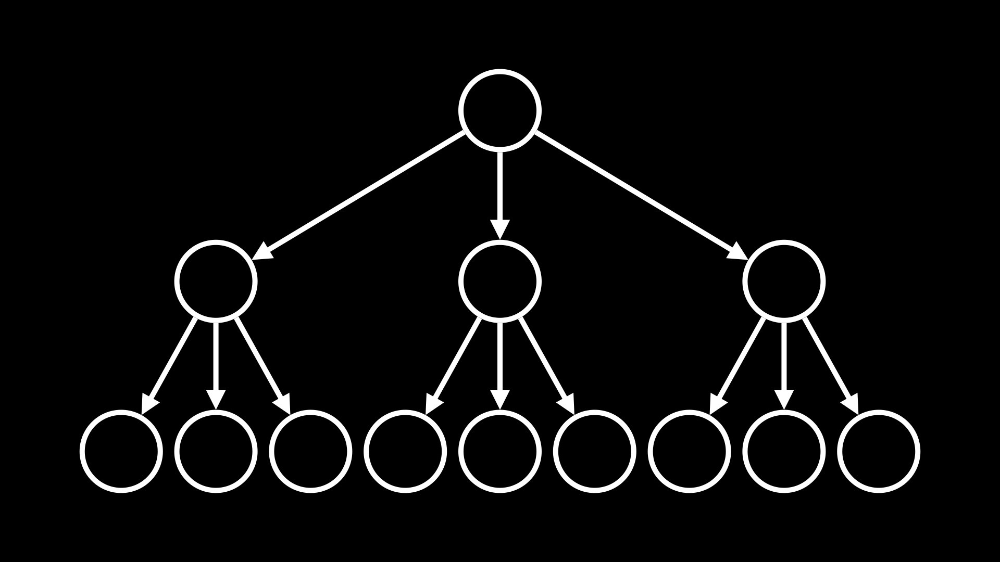
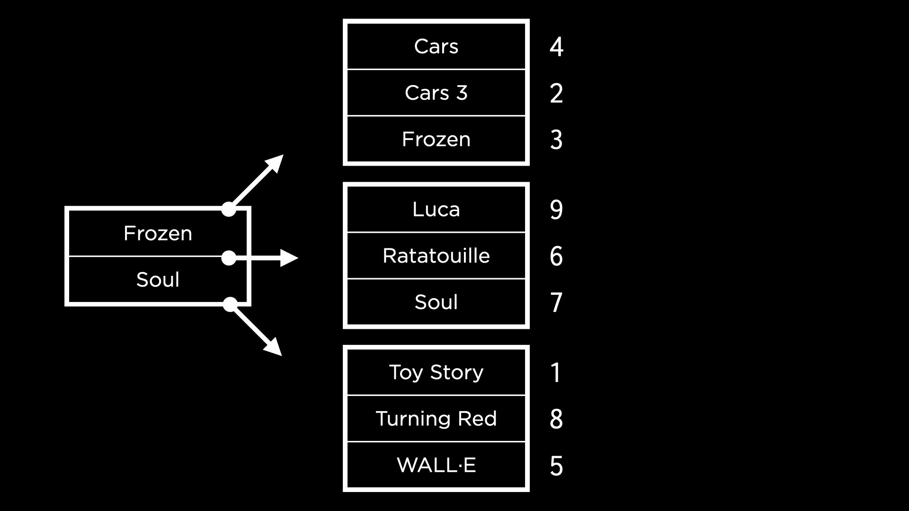

# Optimizing

This week, we will learn how to optimize our SQL queries, both for time and space. We will also learn how to run queries concurrently.

## Index

When we try to find a row(s) with a specific value in some of their columns, the sql engine **scans top to bottom, one row at a time**, to find all the rows with that specific value.

We can **optimize** this query to be more efficient than a scan. In the same way that textbooks often have an __index__, databases tables can have an index as well. **An index**, in database terminology, is a **structure used to speed up the retrieval of rows from a table**.

We can use the following command to create an index for the "title" column in the movies table.
```sql
CREATE INDEX "title_index" ON "movies" ("title");
```

### Index Across Multiple Tables

To understand what kind of **index could help speed up our queries**, we can run `EXPLAIN QUERY PLAN` ahead of the query we want. This will shows us the strategy the engine is following up, when we don't use an `id` column to search something is very likely that the query will use a **scan** Remember that most of the DBMS create an automatically `ìndex` for the `id` column.

Ex:
```sql
SELECT "title" FROM "movies"
WHERE "id" IN (
    SELECT "movie_id" FROM "stars"
    WHERE "person_id" = (
        SELECT "id" FROM "people"
        WHERE "name" = 'Tom Hanks'
    )
);
```

his shows us that the query requires two scans — of people and stars, so we'll create 2 indexes

```sql
CREATE INDEX "person_index" ON "stars" ("person_id");
CREATE INDEX "name_index" ON "people" ("name");
```

The search on the table `people` uses something called a `COVERING INDEX`

A **covering index** means that all the information needed for the query **can be found within the index itself.** Instead of two steps:

- Looking up relevant information in the index,
- Using the index to then search in the table, a **covering index means that we do our search in one step (just the first one)**.

## Space Trade Off

*Indexes seem incredibly helpful, but there are trade-offs associated — they occupy additional space in the database, so while we gain query speed, we do lose space.*

An index is stored in a database as a data structure called a **B-Tree**, or balanced tree. A tree data structure looks something like:



If the movie titles were sorted alphabetically, it would be a lot easier to find a particular movie by using binary search.

In this case, a **copy is made** of the "titles" column. This copy is sorted and then linked back to the original rows within the movies table by pointing to the movie IDs. This is visualized below.



Similar to the space trade-off we discussed earlier, **it also takes longer to insert data into a column and then add it to an index**. Each time a value is added to the index, the B-tree needs to be traversed to figure out where the value should be added!

## Partial Index

This is an index that includes only a subset of rows from a table, allowing us to save some space that a full index would occupy. This is especially useful when we know that users query only a subset of rows from the table.

```sql
EXPLAIN QUERY PLAN
SELECT "title" FROM "movies"
WHERE "year" = 2023;
```

## Vacuum

There are ways to **delete unused space in our database**. SQLite allows us to `vacuum` data — this cleans up previously deleted data (_that is actually not deleted, but just marked as space being available for the next_ `INSERT`).

To find the size of `movies.db` on the terminal, we can use a Unix command

```bash
du -b movies.db
```

In lecture, this command showed us that the size of the database is something like 158 megabytes. We can now connect to our database and drop an index we previously created.

```sql
DROP INDEX "person_index";
```

Now, if we run the Unix command again, we see that the size of the **database has not decreased!** To actually clean up the deleted space, **we need to vacuum it**. We can run the following command in SQLite.

`VACUUM;`

This might take a second or two to run. On running the Unix command to check the size of the database again, we can should see a smaller size. Once we drop all the indexes and vacuum again, the database will be considerably smaller than 158 MB.

## Transactions

To an outside observer, it should seem like the different parts of a transaction happen all at once. In database terminology, a **transaction is an individual unit of work** — something that cannot be broken down into smaller pieces.

Transactions have some properties, which can be remembered using the acronym ACID:
- **atomicity**: can’t be broken down into smaller pieces,
- **consistency**: should not violate a database constraint,
- **isolation**: if multiple users access a database, their transactions cannot interfere with each other,
- **durability**: in case of any failure within the database, all data changed by transactions will remain.

```sql
BEGIN TRANSACTION;
UPDATE "accounts" SET "balance" = "balance" + 10 WHERE "id" = 2;
UPDATE "accounts" SET "balance" = "balance" - 10 WHERE "id" = 1;
COMMIT;
```

The way we implement reverting the transaction is using `ROLLBACK`. Once we begin a transaction and write some SQL statements, **if any of them fail**, we can end it with a `ROLLBACK` to revert all values to their pre-transaction state. This helps keep transactions consistent.

```sql
BEGIN TRANSACTION;
UPDATE "accounts" SET "balance" = "balance" + 10 WHERE "id" = 2;
UPDATE "accounts" SET "balance" = "balance" - 10 WHERE "id" = 1; -- Invokes constraint error
ROLLBACK;
```

## Race Conditions

A race condition occurs when multiple entities simultaneously access and make decisions based on a shared value, potentially causing inconsistencies in the database. Unresolved race conditions can be exploited by hackers to manipulate the database.

To make transactions sequential, database management systems use locks on databases. A table in a database could be in a few different states:

- `UNLOCKED`: this is the default state when no user is accessing the database,
- `SHARED`: when a transaction is reading data from the database, it obtains shared lock that allows other transactions to read simultaneously from the database,
- `EXCLUSIVE`: if a transaction needs to write or update data, it obtains an exclusive lock on the database that does not allow other transactions to occur at the same time (not even a read)